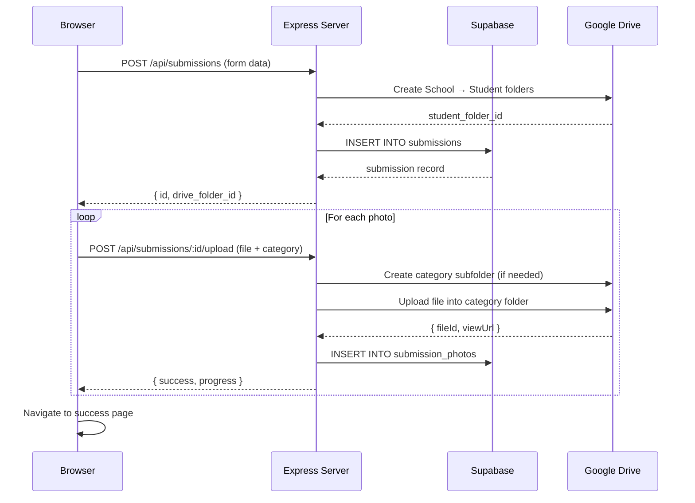

# Submissions Backend — Supabase + Google Drive

Build a backend for the Speculo '26 submissions portal using **Supabase** (contestant data) and **Google Drive** (photo file storage).

---

## Step 1: Setup Guides (Do These First)

### 🟢 Supabase Setup

1. Go to [supabase.com](https://supabase.com) and sign up / log in (GitHub login works)
2. Click **"New Project"**
3. Fill in:
   - **Name:** `speculo-26`
   - **Database Password:** pick a strong one (save it somewhere safe)
   - **Region:** pick the closest to Sri Lanka (e.g. `Southeast Asia (Singapore)`)
4. Wait ~2 minutes for it to provision
5. Once ready, go to **Settings → API** and copy these two values:
   - **Project URL** (looks like `https://abcdefg.supabase.co`)
   - **Service Role Key** (the `service_role` key — NOT the `anon` key)
6. Create a `.env` file in your project root and paste them in:

```env
SUPABASE_URL="https://your-project.supabase.co"
SUPABASE_SERVICE_KEY="your-service-role-key-here"
```

> [!CAUTION]
> The **service role key** bypasses Row Level Security. Never expose it in frontend code — it will only be used server-side in Express.

---

### 🔵 Google Drive API Setup

1. Go to [Google Cloud Console](https://console.cloud.google.com)
2. Create a new project (or select an existing one):
   - Click the project dropdown at the top → **"New Project"** → Name it `Speculo26` → Create
3. **Enable the Drive API:**
   - Go to **APIs & Services → Library**
   - Search for **"Google Drive API"** → Click it → **Enable**
4. **Create a Service Account:**
   - Go to **APIs & Services → Credentials**
   - Click **"+ Create Credentials" → "Service Account"**
   - Name: `speculo-drive-uploader`
   - Click **Done** (skip optional steps)
5. **Generate a JSON Key:**
   - Click on the service account you just created
   - Go to the **"Keys"** tab
   - Click **"Add Key" → "Create new key" → JSON** → Download
   - Save the downloaded `.json` file as `service-account.json` in your project root
6. **Create a shared Google Drive folder:**
   - In your regular Google Drive, create a folder called **`Speculo26_Submissions`**
   - Right-click → **Share** → paste the service account email (looks like `speculo-drive-uploader@speculo26.iam.gserviceaccount.com`) → give it **Editor** access
   - Open the folder → copy the **folder ID** from the URL: `https://drive.google.com/drive/folders/THIS_PART_IS_THE_ID`
7. Add to your `.env`:

```env
GOOGLE_SERVICE_ACCOUNT_KEY_FILE="./service-account.json"
GOOGLE_DRIVE_ROOT_FOLDER_ID="your-folder-id-here"
```

> [!IMPORTANT]
> Add `service-account.json` and `.env` to your `.gitignore` so they never get committed!

---

## Step 2: What I'll Build

### Google Drive Folder Structure

Files will be organized like this in your shared Drive folder:

```
Speculo26_Submissions/
├── Dharmaraja College/
│   ├── Nadil Perera/
│   │   ├── Color/
│   │   │   ├── sunset.jpg
│   │   │   └── flowers.png
│   │   ├── Monochrome/
│   │   │   └── portrait.jpg
│   │   └── Street/
│   │       └── market.jpg
│   └── Kavindu Silva/
│       └── Wildlife/
│           └── bird.jpg
├── Royal College/
│   └── Ashan Fernando/
│       └── Architecture/
│           └── temple.jpg
├── _Open Category/
│   └── John Doe/
│       └── Macro/
│           └── insect.jpg
└── _Physical/
    └── Saman Kumara/
        └── (no photos - physical entry)
```

- **Online Inter & Intra** → grouped by **school name**
- **Online Open** → goes under `_Open Category` (no school)
- **Physical** → goes under `_Physical`
- Within each school → a folder named after the **student's name**
- Within each student → subfolders per **category** (only created when photos are uploaded)

---

### Database Schema (Supabase)

**`submissions` table:**
| Column | Type | Notes |
|---|---|---|
| `id` | `uuid` (PK) | Auto-generated |
| `type` | `text` | `'online_intra'`, `'online_inter'`, `'online_open'`, `'physical'` |
| `name` | `text` | Participant name |
| `email` | `text` | Physical only |
| `phone` | `text` | With +94 prefix |
| `dob` | `date` | Date of birth |
| `grade` | `text` | e.g. "Grade 12" |
| `school` | `text` | School name |
| `president` | `text` | Club president (physical) |
| `drive_folder_id` | `text` | Student's Google Drive folder ID |
| `created_at` | `timestamptz` | Auto-set |

**`submission_photos` table:**
| Column | Type | Notes |
|---|---|---|
| `id` | `uuid` (PK) | Auto-generated |
| `submission_id` | `uuid` (FK → submissions) | Links to parent |
| `category` | `text` | Color, Monochrome, etc. |
| `file_name` | `text` | Original filename |
| `file_size` | `bigint` | Size in bytes |
| `drive_file_id` | `text` | Google Drive file ID |
| `drive_view_url` | `text` | Shareable view link |
| `created_at` | `timestamptz` | Auto-set |

> [!NOTE]
> I'll provide the SQL to create these tables — you just paste it into the Supabase SQL Editor.

---

### New Files

| File | Purpose |
|---|---|
| [NEW] `server/index.ts` | Express server entry point, mounts API routes, serves frontend |
| [NEW] `server/routes/submissions.ts` | API endpoints: `POST /api/submissions`, `POST /api/submissions/:id/upload`, `GET /api/submissions/:id` |
| [NEW] `server/lib/supabase.ts` | Supabase client initialization |
| [NEW] `server/lib/drive.ts` | Google Drive helper: create school/student/category folders, upload files, return shareable links |

### Modified Files

| File | Changes |
|---|---|
| [MODIFY] `.env.example` | Add Supabase + Google Drive env vars |
| [MODIFY] `.gitignore` | Add `service-account.json`, `.env` |
| [MODIFY] `package.json` | Add dependencies (`@supabase/supabase-js`, `googleapis`, `multer`, `cors`), add `start` script |
| [MODIFY] `vite.config.ts` | Add API proxy to Express dev server |
| [MODIFY] `public/Submissions.html` | Wire form submissions + file uploads to API endpoints, add progress bar + error handling |

---

### Architecture Flow



---

## Verification Plan

### Automated
- Hit each endpoint with `curl` after building
- Confirm rows in Supabase dashboard
- Confirm files + folder structure in Google Drive

### Manual
1. Submit a Physical form → verify row in Supabase + folder in Drive under `_Physical/StudentName`
2. Submit an Online Inter form with 3 photos across categories → verify:
   - Supabase `submissions` row + 3 `submission_photos` rows
   - Drive: `SchoolName/StudentName/Category/file.jpg` structure
3. Test edge cases: duplicate names, no school provided, large files, network errors
